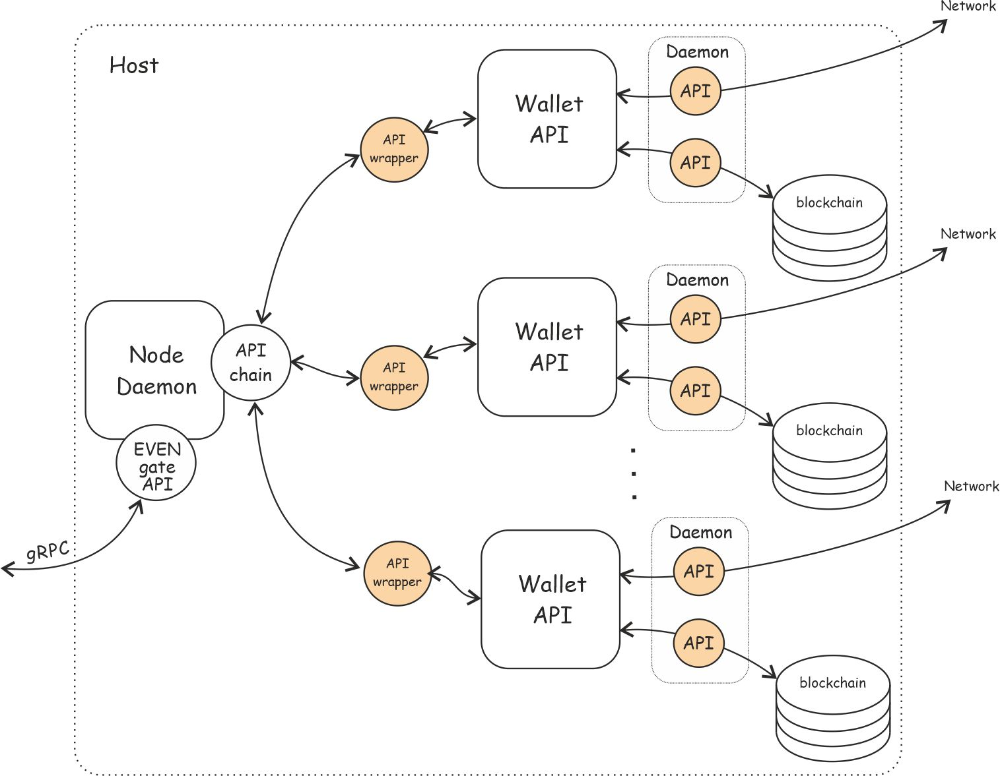

## Структура приложения и API

Программное обеспечение участника сети представляет собой приложение, способное функционировать как:
- Сервис: в различных уровнях сложности;
- Десктоп приложение: как клиентская часть сервиса, локально или удаленно, либо как лайт приложение, имеющее ограниченный функционал;
- Мобильное приложение:  лайт приложение, имеющее ограниченный функционал.

При этом 
- полный функционал подразумевает режим работы с запуском полноценного демона IPFS и локального ;
- клиентский или лайт - функционал электронного кошелька и взаимодействия с полным сервисом, либо с использованием адаптированного упрощенного интерфейса  - сразу с приватной сетью.

В дальнейшем, для удобства,  будем упоминать симбиоз приложения и его владельца как ноду.

Основными модулями ноды должны быть: 
- Модуль создания аккаунта и авторизации пользователя с использованием детерминированной ECDSA подписи на основе положений BTC **BIPЗ9** и **BIP44** - *hdgen*;
- Модуль кошелька, имеющего (универсальные*) интерфейсы для организации сетевого протокола при подсчете баланса и отправки транзакций:
  1. В собственной приватной сети
  2. Во внешних криптовалютных сетях, с которыми будет осуществлен кросс-чейн обмен

- Модуль интерфейса с p2p приватной сетью на основе технологии IPFS
- Модуль обработки сообщений базового протокола;
- Модуль обработки сообщений расширенного протокола, включающий в себя следующие функции:
  1) Валидатора
  2) Моста
  3) Суперюзера

- Модуль виртуальной машины со встроенным компилятором, работающий с адаптированным диалектом компилируемого языка программирования, имеющим следующие возможности:
  1) Ортогональность. Язык должен предоставлять небольшое число средств, не повторяющих функциональность друг друга.
  2) Простая и регулярная грамматика. Минимум ключевых слов, простая, легко разбираемая грамматическая структура, легко читаемый код.
  3) Простая работа с типами. Типизация должна обеспечивать безопасность, но не превращаться в бюрократию, лишь увеличивающую код. Отказ от иерархии типов, но с сохранением объектно-ориентированных возможностей.
  4) Отсутствие неявных преобразований.
  5) Сборка мусора.
  6) Встроенные средства распараллеливания, простые и эффективные.
  7) Поддержка строк, ассоциативных массивов и коммуникационных каналов.
  8) Чёткое разделение интерфейса и реализации.
  9) Эффективная система пакетов с явным указанием зависимостей, обеспечивающая быструю сборку.
  Имея адаптированное к функционалу приложения API виртуальной машины должно предоставлять возможности по созданию сценариев выполнения типовых операций модулями приложения для осуществления базового и расширенного протоколов в двоичном формате;
- Модуль мобильного приложения;
- Модуль кроссплатформенного десктоп приложения;
- Модуль организации локального хранилища с возможностью шардинга в приватную IPFS (swarm).

Первичная разработка должна осуществляться на языке программирования Go с использованием сопутствующих библиотек, пакетов и наработок сообщества открытого программного обеспечения.

## Организация сети

Сеть представляет собой приватную одноранговую p2p сеть, организованную с помощью технологии IPFS со своим IPNS и построенное на его основе глобальное распределенное блокчейн хранилище (DLT). 
Для удобства хеш-адреса объектов IPLD (interplanetary linked data) приватной сети будем называть “адресами IPFS”.

## Ноды с функционалом моста.

Главной проблемой на пути создания полноценного кросс-чейн обмена информационными ресурсами является несовместимость их протоколов и технологий формирования блокчейна. Если бы все сети работали с использованием распределенного DLT хранилища, то реализация API заключалась бы только в адаптации API взаимодействия программного обеспечения кошельков, но так как это невозможно в большинстве случаев, для реализации нашего моста наиболее рационально будет использовать ноду с функционалом транслятора API кошелька - EVEN Gate API. Данный функционал предназначен для использования не только самой нодой, которая его реализует,  но и для других участников сети не желающих  или не имеющих возможности хранить огромные по размерам хранилища блокчейна на своем хосте (мобильные ноды, например).

Для реализации шлюза ноды должны реализовывать функционал, предоставляемый другим участникам сети EVEN Network таким образом, чтобы взаимодействие подключенных нод с внешними сетями было максимально  прозрачным и производительным. При этом интерфейсы API включают следующие методы:
* Латентное  подключение к внешней сети,
* Создание счета в формате внешней сети,
* Получение списка транзакций по указанному пользователем счету,
* Подсчет его баланса,
* Отправку с него транзакций.

Со стороны взаимодействия ноды с интерфейсами кошельков внешних сетей её API составляет тот же универсальный набор методов, имплементируемый для каждой внешней сети своим функциональным наполнением в зависимости от от особенностей реализации конкретных API кошельков для каждой их них.

Нода, реализующая функционал моста, в случае невозможности или других определенных случаев, которые исключают использование функционала внешних кошельков как разделяемого, или подобного этому включению, кода (т.е. как библиотеки, в своем адресном пространстве), должна иметь методы  контроля и управления сервисов внешних сетей, обладающих достаточным для транспорта функционалом. А именно:
* Запись и чтение настроек сервисов,
* Прозрачное редактирование настроек хранилища блокчейна,
* Управление запуском и остановкой сервиса.

Вместе с модулями или сервисами внешних сетей с необходимыми системами управления базами данных, нода может запускаться либо на одном хосте, либо как приложение в облачном хранилище, реализовывая взаимодействие с ними  с использованием их сетевых протоколов.  При этом она продолжает являться участником децентрализованной сети, используя модуль взаимодействия с приватной сетью IPFS, и реализует трансляцию взаимодействия с внешними сетями для мультивалютных кошельков EVEN по протоколу gRPC, настройки которого передаются другим мастер нодам средствами IPNS.

