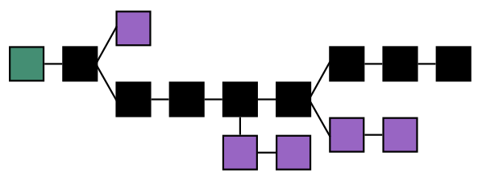
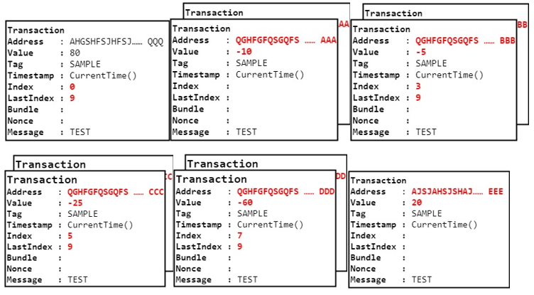
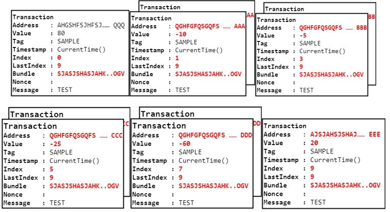
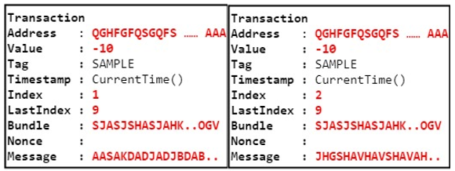
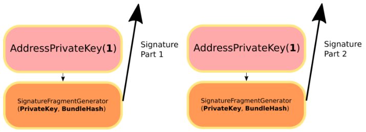

# Базовый протокол сети EVEN

## Выбор технологий

Основной устойчивого функционирования распределенной сети является логически  стройный протокол, позволяющий обеспечить решение трех основных задач: защиты конфиденциальности, распределенности и сохранности данных. Исторически, доверие к продуктам или услугам зарабатывается в течение всей их истории. Физические или электронные записи сопровождают каждый объект и подтверждают его происхождение, назначение, количество и историю. Создание, сопровождение и подтверждение всей этой информации добавляет весомый «налог на доверие», выражающийся в трудозатратах банков, бухгалтерии, юристов, аудиторов, службы контроля качества и других служб. При этом, зачастую, важная информация теряется, бывает недоступна, а иногда и сознательно скрывается.

Четвертая промышленная революция продолжает размывать границу между физическим и цифровым мирами, и блокчейн существенно облегчает аутентичность и целостность данных, необходимых для сопровождения объектов и услуг вдоль всей цепи стоимости. Более того, блокчейн вводит взаимно совместимый слой транзакций, в котором незнакомые между собой стороны могут в реальном времени обмениваться финансовыми и физическими ценностями. 

Блокчейн встраивает кошелек в машины, в результате чего машины могут вести собственный баланс прибылей и убытков, а также дает возможность машинам совершать транзакции с другими машинами в автоматическом режиме. Новые модели бизнеса, ориентированные на взаимодействие между машинами и формы обмена ценностями между ними, появляются чуть ли не каждый день. Однако в том, что касается масштабирования, требований к вычислительным ресурсам и стоимости транзакций, современные технологии блокчейна имеют серьезные ограничения.

В этой связи новым адекватным способом решения известных проблем является технологии распределенного хранения реестра (DLT), которая с каждым днем все глубже проникают в реальный сектор экономики. Причем, они находят себе применение даже в таких традиционно консервативных видах бизнеса, как добыча нефти и газа. Практика показывает, что DLT может успешно применяться везде, где есть большие массивы информации, объединенные в базы данных и нужна их неизменность.

Одной из базовых моделей, успешно реализованных в проектах DLT (IOITA, Byteball) на сегодняшний день является DAG - это тип технологии распределенных реестров, отличающийся от Блокчейнов структурой записей и асинхронностью. 

В классической технологии блокчейн транзакции в начале группируются в блок, после чего, по прошествии какого-то времени такой блок добавляется в цепочку из таких блоков. В такой системе пропускная способность и время транзакции ограничены размером блока и временем, которое необходимо для генерации нового блока.

 
В модели DAG - направленный ацикличный граф (от английского Directed Acyclic Graph) каждая транзакция сразу же добавляется в такой граф, состоящий из множества транзакций, записывающихся не последовательно, а одновременно. Здесь нет блоков, поэтому нет и проблем с его размером.

В такой структуре пользователи сами обслуживают сеть. Прежде, чем отправить какую-либо транзакцию, необходимо подтвердить не менее одной, а чаще две предыдущих. Именно поэтому здесь нет майнеров и мастернод.

Преимущества такого решения:
- Быстрота выполнения транзакций
- Нет комиссий (или они мизерны)
- Более масштабируем по сравнению с блокчейн.

Однако видимые преимущества данной модели в чистом виде компенсируются следующими недостатками:

- Проблемы с масштабируемостью (необходимо синхронизировать блокчейн каждый раз при добавлении новой транзакции).
- При малом количестве участников сети, транзакции могут подтверждаться длительное время, а при их отсутствии вообще никогда не быть подтвержденными.

Имеющиеся недостатки, как показала практика эксплуатации подобного рода сетей, наносят тяжелый урон завоеваниям блокчейн технологий, и речь здесь идет о децентрализации. Например в IOTА, для управления всеми ветвлениями Tangle используется нода Coordiantor, которая по сути является сервером валидации. 

Есть ли пути решить эту проблему и каким-то изящным способом устранить имеющиеся недостатки и превратить их в достоинство?

Анализ существующих подходов в реализации DLT и алгоритма DAG - в частности, позволил предположить, что такое решение есть. При изучении изображений графов транзакций, например сети IOTA,  нетрудно заметить, что временная ось эволюции графа направлена справа налево. Да, так и должно быть:  граф направленный и ациклический, новая транзакция является контентно ориентированным сообщением и в силу этого факта, не ведая своего места в топологии сети, вынуждена уповать на “милость” координатора. И если её не дождаться (а так бывает), транзакция может и не подтвердиться. 

Наше решение, которое позволило изменить направление времени эволюции в DAG и добиться максимальной децентрализации,  это переопределение сущности транзакции из контентно в топологически ориентированную и использование алгоритма подсчета рейтинга. При этом все преимущества модели сохраняются в полном объеме.

**В чем сущность модернизации?**

*1. Так же, как и в классическом DAG, новое сообщение, которое похожим образом формируется из цепочки связанных транзакций со ссылками на хеш заголовки своих транзакций в качестве trunk ветки, представляющие баланс , и в качестве brunch - ссылки от одной до нескольких связанных в сообщения транзакций, которые нода получила для валидации в приватном разделе входящих распределенного хранилища;*

*2. Используя алгоритм подсчета рейтинга, который будет описан ниже, нода формирует список рассылки двух вариантов передач: в первом случае своего сообщения с необходимыми привязками  к графу trunk и brunch,  и во втором - передачу полученных сообщений с признаком валидации после проведенной работы по их проверке с использованием алгоритма МАМ;*

*3. Нода может быть пассивной и ничего не делать - не проводить работу по валидации и транслировать сообщения, но тогда это отразится на её рейтинге, и чтобы осуществить собственные транзакции по переводу средств, ей придется заплатить некоторую комиссию за предоставление сетью необходимого пакета сообщений для валидации.*

Здесь возникает вопрос: каким образом решается вопрос создания топологии в криптозащищенной децентрализованной сети? Как контентно-ориентированные сообщения переходят в разряд адресных посылок без потери конфиденциальности?

Решения  этой проблемы представляется возможным с использованием в базовом протоколе технологии IPFS. Термин «децентрализация» приобрел новое значение с приходом эры криптовалют и технологии блокчейн. Появилось множество новых проектов, аналогов которым просто не существует. Interplanetary File System (IPFS) — это один из характерных примеров. В чем особенность новой технологии и какие возможности она открывает? 

IPFS объединяет в себе шардинг и децентрализованное хранение файлов. Да, большое количество компанией занимается разработкой решений для хранения файлов по частям, в частности, Sia и поддерживаемый корпорацией Google Storj. Однако IPFS работает по другому принципу, наиболее точно воплощая в жизнь симбиоз этих технологий.

Проект начинался как протокол в сети Эфириум в 2016 году. Был выбран именно этот блокчейн из-за большей дружелюбности по отношению к новшествам и инновациям. Биткоин подобным похвастаться не мог. Насколько мудрым было это решение, неясно до сих пор.

Из определения в Wiki мы получаем ответ на главный вопрос: IPFS представляет собой одноранговую распределенную файловую систему, которая соединяет все вычислительные устройства единой системой файлов. В некотором смысле IPFS схожа со всемирной паутиной. IPFS можно представить как единый BitTorrent-рой, обменивающийся файлами единого Git-репозитория. Иными словами, IPFS обеспечивает контентно-адресуемую модель блочного хранилища с контентно-адресуемыми гиперссылками и высокую пропускную способность. **_Это формирует обобщенный древовидный направленный граф._** IPFS сочетает в себе распределенную хэш-таблицу, децентрализованный обмен блоками, а также самосертифицирующееся пространство имён. При этом IPFS не имеет точек отказа, и узлы не обязаны доверять друг другу. Доступ к файловой системе может быть получен различными способами:

- через FUSE
- поверх HTTP.

Локальный файл может быть добавлен в файловую систему IPFS, что делает его доступным всему миру. Файлы идентифицируются по их мультихэшам, что упрощает кэширование. Они распространяются через протокол, основанный на протоколе BitTorrent. Пользователи, просматривающие контент, помогают в доставке контента для других пользователей сети. IPFS имеет сервис имён под названием IPNS, глобальное пространство имен на основе открытых ключей, совместимое с другими пространствами имён и имеющее возможность интегрировать DNS, .onion, .bit и т. д. в IPNS.

Из определения технологии, особенно в части формирования DAG графов, а она действительно использует алгоритм DAG, нетрудно заметить родственность  технологии и возможность их симбиоза в части реализации необходимых для базового протокола свойств.

## Уровни возможностей клиентских приложений и подсети.

Сначала добавим подробностей о том, как работает базовый протокол сети EVEN с использованием IPFS и как происходит виртуальное голосование.

Каждое клиентское приложение (node service), которое подключается к сети EVEN, идентифицируется в сети IPFS уникальным хеш адресом, который она же и предоставляет. У каждого сервиса существует локальное хранилище, разбитое на два раздела - inbox и outbox, которые также уникально идентифицируются хешем как конфиденциальные, но при этом являются физически расположенными на хосте сервиса. 

В режиме трансляции сервис, работающий в нормальном режиме, получает в раздел inbox очередь сообщений, требующих подтверждения. Не вдаваясь в подробности криптографии, о которой речь пойдет ниже, сервис проводит работу по подтверждению полученных сообщений, помечает их валидацию своим nonce по алгоритму HashCach и своим IPFS хеш адресом, и переносит их в раздел outbox. Ту же самую операцию производят остальные сервисы сети, получившие аналогичные пакеты. Но перед тем, как это осуществить, каждый сервис производит рассылку полученных в inbox сообщений адресатам, в очередности, построенной после оценки рейтинга видимых сервисов и необходимостью их посылки, то-есть реализуя протокол Gossip - нужна или не нужна данному сервису эта информация. Это достигается проверкой наличия хеша  сообщения в inbox адресата. Таким образом с большой скоростью происходит заполнение распределенного хранилища валидированными сообщениями.

В режиме создания собственных транзакций последовательность операций тот же, за исключением того, что сервис кроме валидации полученных в inbox сообщений, формирует свое, с указанием ссылок на trunk - ссылку на последнюю входящую в свой адрес транзакцию и её предыдущие для представления баланс, и branch - от одной до нескольких ссылок на подтвержденные сообщения из inbox.

Сервис ноды, который не желает участвовать в процессе подтверждения может игнорировать входящие сообщения и не производить валидацию сообщений, но в этом случае, её рейтинг будет на нулевом уровне и для того, чтобы осуществить свои транзакции, владельцу кошелька придется заплатить сети некоторую комиссию за получение необходимого количества branch ссылок.

Здесь будет уместным пояснить о реализуемом алгоритме BFT - виртуальном голосовании. Здесь в полной мере реализуется  основная причина, по которой в модель базового алгоритма сети была включена IPFS. Валидированные сообщения, размещаемые сервисами нод в собственные разделы outbox, являются общедоступными для чтения в распределенной сети, и кошелек сервиса ноды при подсчете баланса, оценивая количество ссылок на хеши сервисов валидировавших их нод при построении дерева транзакций, вычисляют необходимый консенсус при принятии решения.

Памятуя о главном преимуществе DLT - быстрота выполнения транзакций, могут возникнуть сомнения о возможности базового алгоритма сети его реализовать. Но тут ключевым фактором, гарантирующим запас по скорости, является подсчет рейтинга. Как это работает?

Сервис ноды, выполняющий базовые потребности сети эффективно, как только может, и таким образом поддерживающий её устойчивость и производительность, с учетом неуклонно возрастающего рейтинга (об этом выше), ранжируется в списке рассылки в первых строках. Соответственно, используя тот же алгоритм, этот сервис формирует свой список рассылки, в топ которого попадают такие же эффективные сервисы. Таким образом, динамически - так как рейтинг субстанция переменчивая, - в сети формируется виртуальная подсеть эффективных сервисов, на основании голосов которых можно построить более быстрое виртуальное голосование. Ключевой фразой здесь является -  **_динамический_**. Сеть для предотвращения монополизации консенсуса должна автоматически контролировать баланс участников лидерских подсетей.

## Алгоритм подсчета рейтинга и немного простых формул

Алгоритм подсчета рейтинга носит синтетический характер и его главным назначением является динамический подсчет рейтинга сервиса ноды  с одновременной компенсацией этого значения по техническим и информационным показателям.

Величина функции является безразмерной и имеет физический смысл как относительная доля вклада конкретной ноды в суммарный рейтинг нод сети. Расчет непрерывной функции значения рейтинга ноды $R$ в момент времени $t - R(t)$ затруднен тем, что текущего его значения в дискретной системе отсчета не существует. Т.е., можно говорить, что значение функции верно в моменты времени, совпадающие с изменениями в системе - в сети нод, т.е. $t_{-n}, t_{0}...t_{\infty}$. В данной методике на основе анализа показателей, от которых зависит значение функции в дискретные моменты на выбранном историческом периоде и предположения о существовании зависимости суммарного рейтинга сети от рыночных настроений, делается предположение о возможности кратковременного полиномиального прогнозирования его значения   на основе статистических сетевых данных.

В каждый период отсчета работы сети, значение рейтинга ноды зависит от нескольких параметров:

*1. Относительного вклада мощности ноды в суммарную мощность сети.*

Здесь стоит упомянуть тот факт, что большинство алгоритмов информационного обмена и верификации данных в распределенной сети предусматривает равноправное участие её активных членов в этом процессе.   Посему **_мощность_**  конкретной ноды, как полноценного участника, влияет на среднее время обработки информации. Её относительное значение зависит от суммарной вычислительной мощности сети -  $P$  , которую можно представить, как сумму дискретных значений мощности нод сети:

$$P=\sum\limits_{i=0}^MP_{i}(T=t_{j})\tag{1.1}$$

Где $M$   количество нод в сети, $P_{i}$ вычислительная мощность $i$- ой ноды в дискретный момент $T$ - из $j$-го события.

При этом **_относительный вклад мощности ноды_** в суммарную вычислительную мощность сети выглядит как:

$$P_{0}=\frac{P_{i}(T=t_{j})}{P}\tag{1.2}$$

**Примечание:** *Очевидно, что увеличение суммарной мощности сети нод при постоянном её значении у конкретной ноды приводит к уменьшению значения её относительного веса в системе, что необходимо учесть при  учете влияния на результирующий показатель.*

*2.  Относительной скорости работы сети.*

Величина $V_{N}$ которая определяется количеством подтвержденных пакетов передачи данных за единицу времени в сети, в которой работает нода, очевидно, будет влиять на её рейтинг. Памятуя о том, что результатом данной методики является величина относительная, целесообразно пронормировать данный показатель Vo либо к среднему его значению по сети, либо к максимальному значению. Данный выбор можно сделать экспериментальным путем, при вычислении уровня неопределенности значения функции рейтинга ноды.

*3. Относительного вклада ноды в информационный обмен - активности.*

Относительная доля вклада конкретной ноды в информационный обмен Ko характеризует её активность. Он зависит от суммарного значения объема информационного обмена - количества единиц информации  $K$, передаваемой в распределенной сети за интервал времени активными участниками сети, подсчитанного статистически, и объема вклада $K_{i}$ -ой ноды в этот обмен.

Здесь следует заметить, что существенное влияние на данный показатель оказывают 1 и 2 из упомянутых выше, что позволяет предположить его интегральную природу. То-есть, его значение в дискретный период времени $j$ го события есть величина площади фигуры, ограниченной функцией изменения суммарного информационного обмена за период времени $\Delta{t}$  в зависимости от скорости изменения вклада $i$ -ой ой ноды, которая определяется производной от функций изменения относительных величин 1 и 2:

(1.3)

$$ K_{0}=\frac{K_{i}}{K}\int\limits_{t_{j-1}}^{t_{j}}\frac{V_{0}(t)+P_{0}(t)dt}{2}\tag{1.4}$$

При рассмотрении графика зависимости можно предположить,  что бесконечно увеличение мощности ноды не повлечет за собой бесконечного роста относительной доли вклада и закономерность её распределения, например, при полиномиальном прогнозе, будет иметь экспоненциальный характер, что можно будет использовать для компенсации его влияния на распределение, учитывая вес следующих показателей.

*4.  Суммы ставок.*

Учитывая одно из основных требований peer-to-peer сети, которое исключает рост доминирования её отдельных членов в оперативном обмене информацией, с целью предотвращения её централизации данный показатель можно использовать как  **компенсирующий** influence of technical indicators 1, 2 and 3. Предваряя описание, суть подхода в том, что расчет рейтинга ноды в момент времени $t$ производится расчетом среднего значения натурального логарифма от относительной суммы ставок и  логарифмически обратной функции от значения относительного вклада ноды в информационный обмен.  То-есть приведенная сумма ставок $S$ за время $j$-го периода событий логарифмически инверсна относительному вкладу в информационный обмен.

Данная зависимость демонстрирует компенсационную взвешенность подсчета рейтинга нод из абсолютно разных “весовых” категорий.  То-есть, при максимально возможном увеличении вычислительных ресурсов, качества сети и активности и при таких же максимальных суммах ставок, рейтинг ноды останется не более чем на среднем уровне. При других определенных значениях, возможны более высокие или более низкие рейтинги, не противоречащие логике.
Таким образом

$$S_{0}={S_i(T=t_{i})}/{\sum\limits_{i_{0}}^{N}S_{i}}\tag{1.5}$$

Где $S_{i}$- сумма ставок $i$-ой ноды за время события $j$, $S_{0}$- приведенное значение суммы ставок $i$-й ноды за время события $j$. 

**Примечание:** *Уместно будет пояснить, что время события j есть интервал времени от последнего события в сети, при котором были получены последние значения необходимых в данной методике показателей.*

*5. Достоверности исторической информации, то-есть “слухов”*

В системах с распределенным подтверждением транзакций, для реализации большинства алгоритмов консенсуса, используется информация о прошлых событиях в сети. Но учитывая тот факт, что далеко не все ноды могут физически находится в сети, в их блокчейнах формируются пробелы, в силу чего остальные ноды, при запросе о восстановлении своих недостающих данных при вычислении алгоритма консенсуса, вынуждены впустую тратить вычислительный ресурс на запрос у них несуществующих данных. Чтобы снизить вероятность такого исхода и тем самым сохранить скоростные показатели обмена в сети на требуемом уровне, необходимо включить в расчет рейтинга приведенную достоверность информации $I_{0}$ как отношение количества пробелов в блокчейне с общим объемом единиц информации    в нем. В **_отличии от показателя 3_**, данный показатель формируется не относительно всей сети, а о собственных ресурсах ноды. 

Формально, его можно учесть как весовой мультипликативный коэффициент при расчете окончательного рейтинга ноды.

**Описание методики**

С учетом приведенных показателей и исходя из гипотезы, первый этап расчета рейтинга  в момент времени t за время действия события j выглядит следующим образом:

}})/2\tag{1.6})

На данном этапе, как уже сказано,  мы получаем дискретное значение рейтинга за время события $j$.
Уточненная же задача методики состоит в том, чтобы иметь с высокой вероятность достоверное значение рейтинга в заданный непрерывный период $\Delta{t}$  с момента окончания события $j$ .

Для наглядности построим графики относительный зависимостей, изложенных выше. 

 
На рисунке наглядно представлена зависимость относительной величины рейтинга ноды относительно других в сети, которая отсчитывается по оси ординат от точки пересечения графиков двух функций:  $K$, характеризующей относительную техническую оснащенность сервиса, его сетевые параметры, хеш рейт и ping time, и $S$ - относительный баланс. Значение рейтинга максимально в точке пересечения, т.е  при достижении баланса двух показателей, т.е. Их взаимной компенсации. Другими словами - повысить свой рейтинг максимально скупив все токены или создав супермощный пул вычислительных мощностей невозможно, рейтинг будет компенсирован. В теории это возможно, но это при наличии одного сервиса ноды в сети.

Если изобразить графики по другому

 
можно увидеть среднее отсчет значения рейтинга как среднее значение показателей $K$ и $S$ на синтетической кривой из значений. 
(Исходный приложение для демонстрации работы алгоритма можно скачать из репозитория GitHub по сслылке - https://github.com/evenfound/even-network/tree/master/r-score-demo).

## Структура транзакций и сообщений

Чтобы понять как в базовом протоколе реализуется передача информационных активов - обратимся к классике. Алиса имеет начальное число A_SECRET_SEED, которое содержит 100 единиц в 4 разных адресах, в сумма балансов которых и дает это значение:

	seed : A_SECRET_SEED 
	address[0] : QGHFGFQSGQFS …… AAA, balance : 10 
	address[1] : QGHFGFQSGQFS …… BBB, balance : 5 
	address[2] : QGHFGFQSGQFS …… CCC, balance : 25 
	address[3] : QGHFGFQSGQFS …… DDD, balance : 60 
	address[4] : QGHFGFQSGQFS …… EEE, balance : 0

Боб ничего не имеет на своих кошельках:

	seed : B_SECRET_SEED 
	address[0] : AHGSHFSJHFSJ…… QQQ, balance : 0 
	address[1] : AHGSHFSJHFSJ…… VVV, balance : 0

Алиса принимает решение отправить Бобу 80 единиц информации на адрес AHGSHFSJHFSJ…… QQQ . 
Сообщением в базовом протоколе EVEN является связанный хеш индексами набор транзакций трех типов: ввод, вывод и мета-транзакции. 
Для нашего сценария сначала необходимо  подготовить выходную транзакцию, что означает, что мы хотим отправить на адрес Боба  80 единиц информации:

*Вывести транзакцию на адрес Боба 80 информационных единиц*

Далее нужно будет подготовить входную транзакцию. В данном сценарии потребуется использовать все четыре адреса, которые содержат ( 10 + 5 + 25 + 60 > 80) информационных единиц для выполнения выходного значения в сумме 80.

*Четыре входные транзакции, которые расходуют единицы по адресу Боба*

Далее нужно будет подготовить входную транзакцию. В данном сценарии потребуется использовать все четыре адреса, которые содержат ( 10 + 5 + 25 + 60 > 80) информационных единиц для выполнения выходного значения в сумме 80. 
Входная транзакция должна содержать подпись транзакции, это означает, что необходимо добавить  дополнительную мета-транзакцию для переноса подписи, необходимо добавить её:

*Добавление в сообщение мета-транзакций для передачи подписи*

Формирование сообщения не закончено - получен не сбалансированный пакет. Так как сформировано четыре транзакции на 100 информационных  единиц: 10 + 5 + 25 + 60 = 100 входов и 80 выходов, существует остаток в размере 20 информационных единиц,  которые нужно вернуть на счет кошелька отправителя. Для этого необходимо сформировать дополнительную транзакцию. Кошелек создает новый адрес для получения выходной транзакции остатка с пометкой *_unspend_*:

 

После этого сбалансированный пакет получен и можно приступать к окончательному формированию сообщения. Для этого необходимо заполнить последовательно индексы транзакций, последний индекс и сгенерировать **хеш-функцию** пакета с помощью **хеш-функции SHA-3**. 

*Заполнение индексов*

После этого сбалансированный пакет получен и можно приступать к окончательному формированию сообщения. Для этого необходимо заполнить последовательно индексы транзакций, последний индекс и сгенерировать **хеш-функцию** пакета с помощью **хеш-функции SHA-3**. Используемая хеш-функция использует алгоритм губки, который последовательно будет поглощать транзакции, проверяя каждый элемент по одному (порядок важен), а затем генерировать  результат. Кроме того, на этапе получения хеша пакета функция проверит, является ли хеш пакета безопасным или нет. Если нет, она изменит устаревший тег uголовной транзакции (транзакция с индексом 0) и снова сгенерирует хеш.
Псоле того, как хеш сообщения получен, необходимо продолжить заполнение транзакций и получить следующий набор:

*Заполнение хешей сообщения*

Далее необходимо подписать входные транзакции с помощью закрытого ключа соответствующего адреса. Для этого можно получить адресный закрытый ключ от генератора ключей с помощью A_SECRET_SEED HD кошелька. Используя адресный секретный ключ, становиться возможным  использование Генератора фрагментов подписи с закрытым ключом и пакетным хешем для получения подписи транзакции.

 

*Использование генератора ключей для получения генератора фрагмента подписи.*
  
 

 

*Заполнение подписи соответствующим генератором фрагментов подписи 
для каждой входной транзакции.*

После этого все части сообщения готовы.

Далее происходит подключение цепи собственных транзакции указанием в поле trunk значения  хеша последней входной транзакции и подключение цепи транзакций, полученных в раздел inbox неподтвержденных транзакций указанием хеше	й головных транзакций сообщений. Ниже представлен эскиз  схемы подключения.
 
 

*Схема подключения ветвей DAG.*

 

После этого сообщение готово к отправке.

