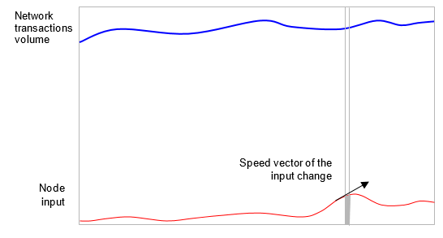
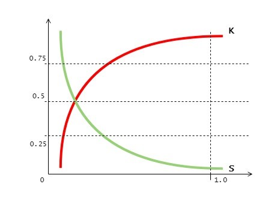
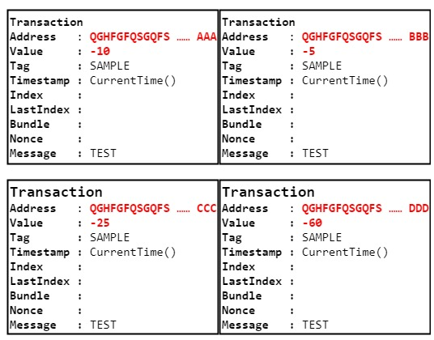
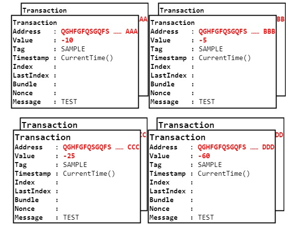
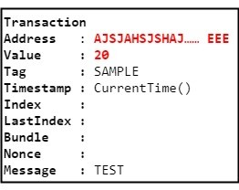
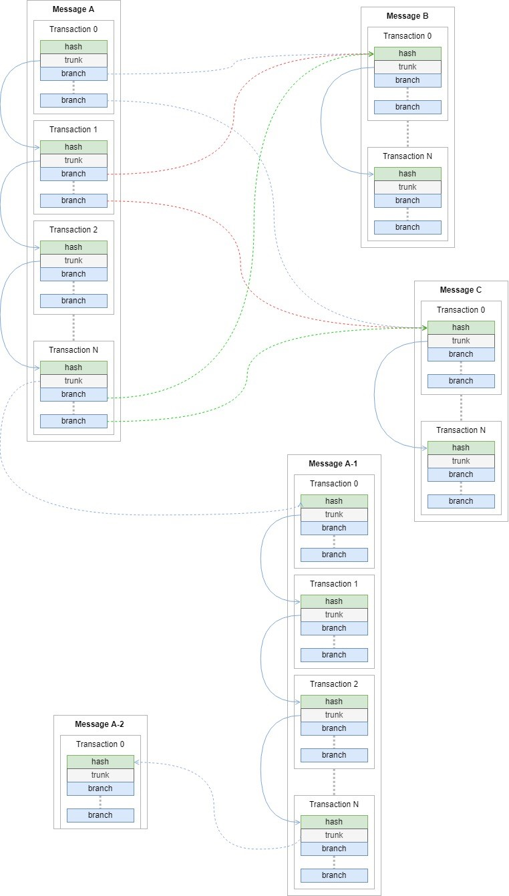
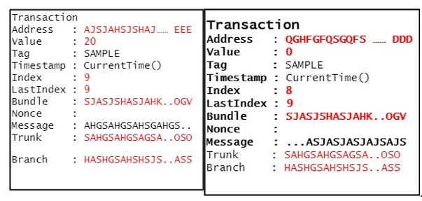

# Базовый протокол сети EVEN

## Выбор технологий

Основной устойчивого функционирования распределенной сети является логически  стройный протокол, позволяющий обеспечить решение трех основных задач: защиты конфиденциальности, распределенности и сохранности данных. Исторически, доверие к продуктам или услугам зарабатывается в течение всей их истории. Физические или электронные записи сопровождают каждый объект и подтверждают его происхождение, назначение, количество и историю. Создание, сопровождение и подтверждение всей этой информации добавляет весомый «налог на доверие», выражающийся в трудозатратах банков, бухгалтерии, юристов, аудиторов, службы контроля качества и других служб. При этом, зачастую, важная информация теряется, бывает недоступна, а иногда и сознательно скрывается.

Четвертая промышленная революция продолжает размывать границу между физическим и цифровым мирами, и блокчейн существенно облегчает аутентичность и целостность данных, необходимых для сопровождения объектов и услуг вдоль всей цепи стоимости. Более того, блокчейн вводит взаимно совместимый слой транзакций, в котором незнакомые между собой стороны могут в реальном времени обмениваться финансовыми и физическими ценностями. 

Блокчейн встраивает кошелек в машины, в результате чего машины могут вести собственный баланс прибылей и убытков, а также дает возможность машинам совершать транзакции с другими машинами в автоматическом режиме. Новые модели бизнеса, ориентированные на взаимодействие между машинами и формы обмена ценностями между ними, появляются чуть ли не каждый день. Однако в том, что касается масштабирования, требований к вычислительным ресурсам и стоимости транзакций, современные технологии блокчейна имеют серьезные ограничения.

В этой связи новым адекватным способом решения известных проблем является технологии распределенного хранения реестра (DLT), которая с каждым днем все глубже проникают в реальный сектор экономики. Причем, они находят себе применение даже в таких традиционно консервативных видах бизнеса, как добыча нефти и газа. Практика показывает, что DLT может успешно применяться везде, где есть большие массивы информации, объединенные в базы данных и нужна их неизменность.

Одной из базовых моделей, успешно реализованных в проектах DLT (IOITA, Byteball) на сегодняшний день является DAG - это тип технологии распределенных реестров, отличающийся от Блокчейнов структурой записей и асинхронностью. 

В классической технологии блокчейн транзакции в начале группируются в блок, после чего, по прошествии какого-то времени такой блок добавляется в цепочку из таких блоков. В такой системе пропускная способность и время транзакции ограничены размером блока и временем, которое необходимо для генерации нового блока.

 
В модели DAG - направленный ацикличный граф (от английского Directed Acyclic Graph) каждая транзакция сразу же добавляется в такой граф, состоящий из множества транзакций, записывающихся не последовательно, а одновременно. Здесь нет блоков, поэтому нет и проблем с его размером.

В такой структуре пользователи сами обслуживают сеть. Прежде, чем отправить какую-либо транзакцию, необходимо подтвердить не менее одной, а чаще две предыдущих. Именно поэтому здесь нет майнеров и мастернод.

Преимущества такого решения:
- Быстрота выполнения транзакций
- Нет комиссий (или они мизерны)
- Более масштабируем по сравнению с блокчейн.

Однако видимые преимущества данной модели в чистом виде компенсируются следующими недостатками:

- Проблемы с масштабируемостью (необходимо синхронизировать блокчейн каждый раз при добавлении новой транзакции).
- При малом количестве участников сети, транзакции могут подтверждаться длительное время, а при их отсутствии вообще никогда не быть подтвержденными.

Имеющиеся недостатки, как показала практика эксплуатации подобного рода сетей, наносят тяжелый урон завоеваниям блокчейн технологий, и речь здесь идет о децентрализации. Например в IOTА, для управления всеми ветвлениями Tangle используется нода Coordiantor, которая по сути является сервером валидации. 

Есть ли пути решить эту проблему и каким-то изящным способом устранить имеющиеся недостатки и превратить их в достоинство?

Анализ существующих подходов в реализации DLT и алгоритма DAG - в частности, позволил предположить, что такое решение есть. При изучении изображений графов транзакций, например сети IOTA,  нетрудно заметить, что временная ось эволюции графа направлена справа налево. Да, так и должно быть:  граф направленный и ациклический, новая транзакция является контентно ориентированным сообщением и в силу этого факта, не ведая своего места в топологии сети, вынуждена уповать на “милость” координатора. И если её не дождаться (а так бывает), транзакция может и не подтвердиться. 

Наше решение, которое позволило изменить направление времени эволюции в DAG и добиться максимальной децентрализации,  это переопределение сущности транзакции из контентно в топологически ориентированную и использование алгоритма подсчета рейтинга. При этом все преимущества модели сохраняются в полном объеме.

**В чем сущность модернизации?**

*1. Так же, как и в классическом DAG, новое сообщение, которое похожим образом формируется из цепочки связанных транзакций со ссылками на хеш заголовки своих транзакций в качестве trunk ветки, представляющие баланс , и в качестве brunch - ссылки от одной до нескольких связанных в сообщения транзакций, которые нода получила для валидации в приватном разделе входящих распределенного хранилища;*

*2. Используя алгоритм подсчета рейтинга, который будет описан ниже, нода формирует список рассылки двух вариантов передач: в первом случае своего сообщения с необходимыми привязками  к графу trunk и brunch,  и во втором - передачу полученных сообщений с признаком валидации после проведенной работы по их проверке с использованием алгоритма МАМ;*

*3. Нода может быть пассивной и ничего не делать - не проводить работу по валидации и транслировать сообщения, но тогда это отразится на её рейтинге, и чтобы осуществить собственные транзакции по переводу средств, ей придется заплатить некоторую комиссию за предоставление сетью необходимого пакета сообщений для валидации.*

Здесь возникает вопрос: каким образом решается вопрос создания топологии в криптозащищенной децентрализованной сети? Как контентно-ориентированные сообщения переходят в разряд адресных посылок без потери конфиденциальности?

Решения  этой проблемы представляется возможным с использованием в базовом протоколе технологии IPFS. Термин «децентрализация» приобрел новое значение с приходом эры криптовалют и технологии блокчейн. Появилось множество новых проектов, аналогов которым просто не существует. Interplanetary File System (IPFS) — это один из характерных примеров. В чем особенность новой технологии и какие возможности она открывает? 

IPFS объединяет в себе шардинг и децентрализованное хранение файлов. Да, большое количество компанией занимается разработкой решений для хранения файлов по частям, в частности, Sia и поддерживаемый корпорацией Google Storj. Однако IPFS работает по другому принципу, наиболее точно воплощая в жизнь симбиоз этих технологий.

Проект начинался как протокол в сети Эфириум в 2016 году. Был выбран именно этот блокчейн из-за большей дружелюбности по отношению к новшествам и инновациям. Биткоин подобным похвастаться не мог. Насколько мудрым было это решение, неясно до сих пор.

Из определения в Wiki мы получаем ответ на главный вопрос: IPFS представляет собой одноранговую распределенную файловую систему, которая соединяет все вычислительные устройства единой системой файлов. В некотором смысле IPFS схожа со всемирной паутиной. IPFS можно представить как единый BitTorrent-рой, обменивающийся файлами единого Git-репозитория. Иными словами, IPFS обеспечивает контентно-адресуемую модель блочного хранилища с контентно-адресуемыми гиперссылками и высокую пропускную способность. **_Это формирует обобщенный древовидный направленный граф._** IPFS сочетает в себе распределенную хэш-таблицу, децентрализованный обмен блоками, а также самосертифицирующееся пространство имён. При этом IPFS не имеет точек отказа, и узлы не обязаны доверять друг другу. Доступ к файловой системе может быть получен различными способами:

- через FUSE
- поверх HTTP.

Локальный файл может быть добавлен в файловую систему IPFS, что делает его доступным всему миру. Файлы идентифицируются по их мультихэшам, что упрощает кэширование. Они распространяются через протокол, основанный на протоколе BitTorrent. Пользователи, просматривающие контент, помогают в доставке контента для других пользователей сети. IPFS имеет сервис имён под названием IPNS, глобальное пространство имен на основе открытых ключей, совместимое с другими пространствами имён и имеющее возможность интегрировать DNS, .onion, .bit и т. д. в IPNS.

Из определения технологии, особенно в части формирования DAG графов, а она действительно использует алгоритм DAG, нетрудно заметить родственность  технологии и возможность их симбиоза в части реализации необходимых для базового протокола свойств.

## Уровни возможностей клиентских приложений и подсети.

Сначала добавим подробностей о том, как работает базовый протокол сети EVEN с использованием IPFS и как происходит виртуальное голосование.

Каждое клиентское приложение (node service), которое подключается к сети EVEN, идентифицируется в сети IPFS уникальным хеш адресом, который она же и предоставляет. У каждого сервиса существует локальное хранилище, разбитое на два раздела - inbox и outbox, которые также уникально идентифицируются хешем как конфиденциальные, но при этом являются физически расположенными на хосте сервиса. 

В режиме трансляции сервис, работающий в нормальном режиме, получает в раздел inbox очередь сообщений, требующих подтверждения. Не вдаваясь в подробности криптографии, о которой речь пойдет ниже, сервис проводит работу по подтверждению полученных сообщений, помечает их валидацию своим nonce по алгоритму HashCach и своим IPFS хеш адресом, и переносит их в раздел outbox. Ту же самую операцию производят остальные сервисы сети, получившие аналогичные пакеты. Но перед тем, как это осуществить, каждый сервис производит рассылку полученных в inbox сообщений адресатам, в очередности, построенной после оценки рейтинга видимых сервисов и необходимостью их посылки, то-есть реализуя протокол Gossip - нужна или не нужна данному сервису эта информация. Это достигается проверкой наличия хеша  сообщения в inbox адресата. Таким образом с большой скоростью происходит заполнение распределенного хранилища валидированными сообщениями.

В режиме создания собственных транзакций последовательность операций тот же, за исключением того, что сервис кроме валидации полученных в inbox сообщений, формирует свое, с указанием ссылок на trunk - ссылку на последнюю входящую в свой адрес транзакцию и её предыдущие для представления баланс, и branch - от одной до нескольких ссылок на подтвержденные сообщения из inbox.

Сервис ноды, который не желает участвовать в процессе подтверждения может игнорировать входящие сообщения и не производить валидацию сообщений, но в этом случае, её рейтинг будет на нулевом уровне и для того, чтобы осуществить свои транзакции, владельцу кошелька придется заплатить сети некоторую комиссию за получение необходимого количества branch ссылок.

Здесь будет уместным пояснить о реализуемом алгоритме BFT - виртуальном голосовании. Здесь в полной мере реализуется  основная причина, по которой в модель базового алгоритма сети была включена IPFS. Валидированные сообщения, размещаемые сервисами нод в собственные разделы outbox, являются общедоступными для чтения в распределенной сети, и кошелек сервиса ноды при подсчете баланса, оценивая количество ссылок на хеши сервисов валидировавших их нод при построении дерева транзакций, вычисляют необходимый консенсус при принятии решения.

Памятуя о главном преимуществе DLT - быстрота выполнения транзакций, могут возникнуть сомнения о возможности базового алгоритма сети его реализовать. Но тут ключевым фактором, гарантирующим запас по скорости, является подсчет рейтинга. Как это работает?

Сервис ноды, выполняющий базовые потребности сети эффективно, как только может, и таким образом поддерживающий её устойчивость и производительность, с учетом неуклонно возрастающего рейтинга (об этом выше), ранжируется в списке рассылки в первых строках. Соответственно, используя тот же алгоритм, этот сервис формирует свой список рассылки, в топ которого попадают такие же эффективные сервисы. Таким образом, динамически - так как рейтинг субстанция переменчивая, - в сети формируется виртуальная подсеть эффективных сервисов, на основании голосов которых можно построить более быстрое виртуальное голосование. Ключевой фразой здесь является -  **_динамический_**. Сеть для предотвращения монополизации консенсуса должна автоматически контролировать баланс участников лидерских подсетей.

## Алгоритм подсчета рейтинга и немного простых формул

Алгоритм подсчета рейтинга носит синтетический характер и его главным назначением является динамический подсчет рейтинга сервиса ноды  с одновременной компенсацией этого значения по техническим и информационным показателям.

Величина функции является безразмерной и имеет физический смысл как относительная доля вклада конкретной ноды в суммарный рейтинг нод сети. Расчет непрерывной функции значения рейтинга ноды $R$ в момент времени $t - R(t)$ затруднен тем, что текущего его значения в дискретной системе отсчета не существует. Т.е., можно говорить, что значение функции верно в моменты времени, совпадающие с изменениями в системе - в сети нод, т.е. $t_{-n}, t_{0}...t_{\infty}$. В данной методике на основе анализа показателей, от которых зависит значение функции в дискретные моменты на выбранном историческом периоде и предположения о существовании зависимости суммарного рейтинга сети от рыночных настроений, делается предположение о возможности кратковременного полиномиального прогнозирования его значения   на основе статистических сетевых данных.

В каждый период отсчета работы сети, значение рейтинга ноды зависит от нескольких параметров:

*1. Относительного вклада мощности ноды в суммарную мощность сети.*

Здесь стоит упомянуть тот факт, что большинство алгоритмов информационного обмена и верификации данных в распределенной сети предусматривает равноправное участие её активных членов в этом процессе.   Посему **_мощность_**  конкретной ноды, как полноценного участника, влияет на среднее время обработки информации. Её относительное значение зависит от суммарной вычислительной мощности сети -  **_P_**  , которую можно представить, как сумму дискретных значений мощности нод сети:

$$P=\sum\limits_{i=0}^MP_{i}(T=t_{j})\tag{1.1}$$

Где $M$   количество нод в сети, $P_{i}$ вычислительная мощность $i$- ой ноды в дискретный момент $T$ - из $j$-го события.

При этом **_относительный вклад мощности ноды_** в суммарную вычислительную мощность сети выглядит как:

$$P_{0}=\frac{P_{i}(T=t_{j})}{P}\tag{1.2}$$

**Примечание:** *Очевидно, что увеличение суммарной мощности сети нод при постоянном её значении у конкретной ноды приводит к уменьшению значения её относительного веса в системе, что необходимо учесть при  учете влияния на результирующий показатель.*

*2.  Относительной скорости работы сети.*

Величина $V_{N}$ которая определяется количеством подтвержденных пакетов передачи данных за единицу времени в сети, в которой работает нода, очевидно, будет влиять на её рейтинг. Памятуя о том, что результатом данной методики является величина относительная, целесообразно пронормировать данный показатель Vo либо к среднему его значению по сети, либо к максимальному значению. Данный выбор можно сделать экспериментальным путем, при вычислении уровня неопределенности значения функции рейтинга ноды.

*3. Относительного вклада ноды в информационный обмен - активности.*

Относительная доля вклада конкретной ноды в информационный обмен Ko характеризует её активность. Он зависит от суммарного значения объема информационного обмена - количества единиц информации  $K$, передаваемой в распределенной сети за интервал времени активными участниками сети, подсчитанного статистически, и объема вклада $K_{i}$ -ой ноды в этот обмен.

Здесь следует заметить, что существенное влияние на данный показатель оказывают 1 и 2 из упомянутых выше, что позволяет предположить его интегральную природу. То-есть, его значение в дискретный период времени $j$ го события есть величина площади фигуры, ограниченной функцией изменения суммарного информационного обмена за период времени $\Delta{t}$  в зависимости от скорости изменения вклада $i$ -ой ой ноды, которая определяется производной от функций изменения относительных величин 1 и 2:

(1.3)

$$ K_{0}=\frac{K_{i}}{K}\int\limits_{t_{j-1}}^{t_{j}}\frac{V_{0}(t)+P_{0}(t)dt}{2}\tag{1.4}$$

On examining the dependency schedule it can be assumed that the endless increase in node capacity does not entail an endless increase in the *relative input share* and the principle of its distribution, for instance, on a polynomial prognosis, will be of an exponential character, which can be used to offset its impact on distribution, factoring in the weight of the following indicators.

*4.  Setting totals.*

Considering one of the basic requirements of a peer-to-peer network which excludes an increasing domination of its separate members in the operational information exchange, with the aim of preventing its centralization of data this indicator can be used as an **offsetting** influence of technical indicators 1, 2 and 3. Prefacing the description, the approach resides essentially in the fact that the calculation of the node ranking at the moment of time t is made by calculating the average value of the natural logarithm from the relative amount of settings and the logarithmically reverse function from the value of the relative input of the node into the information exchange. In other words, the number of $S$ settings over the j period of events is lograrithmically inverse to the relative input into the information exchange.

This dependency demonstrates the offsetting deliberateness of calculating the node ranking from absolutely different weight categories. In other words, with the maximum possible increase in computing resources, network quality and activity and with the same maximum setting totals, the node ranking will remain no greater than at the average level. With other defined values, higher or lower rankings that do not contradict logic are possible. 
Thus 

	S_o=1/(∑_(i=0)^N S_i ) S_i (T=t_j)                                        (1.5)

Where the settings total of the i node over the period of the j event is the value of the settings total of the i node over the time of the j event.

**Note:** *It will be appropriate to explain that the time of event j is the time interval from the last event in the network in which the latest values required in this method of indicators were obtained.*

*5. Accuracy of historical information, that is, of 'rumors'*

In systems with a distributed confirmation of transactions, in order to implement most consensus algorithms information on past events in the network is used.

But factoring in the fact that by no means all modes can physically be situated in the network, their blockchains form blank spots whereby the other nodes when there is a request to restore missing data on calculating the consensus algorithm are forced to lose the computing resource for the request for non-existent data.

In order to reduce the likelihood of such an outcome and thereby maintain the exchange speed indicators in the network at the required level, it is essential to include in the ranking calculation the accuracy of information *I_o* as a ratio of the number of blank spots in the blockchain to the total amount of information units in it. **As opposed to parameter 3**, this parameter is formed not in relation to the whole network but on the node's own resources.

Formally, it can be considered as a weight multiplicative coefficient with a calculation of the final node ranking.

**Description of the method**

Factoring in these indicators and based on a hypothesis, the first stage of the ranking calculation at the moment of time t over the time of the event j looks as follows:

	R_j=I_0   (lnS_o+(ln K_0)/(K_0-1))/2                                                (1.6)

At this stage, as already stated, we obtain the discrete value ranking over the time of the event j.
A more refined task of the modality is in having with high probability an accurate ranking value in this uninterrupted period *Δt*  from the moment event *j* ends.

For illustration purposes let us construct a graph of relative dependencies outlined above.

 
The diagram shows the dependency of a relative value of a node ranking with regard to others in the network which is measured along the vertical axis from the point where the schedules of the two functions intersect: K, which characterises the relative technical provision of the service and its network parameters, is the hash rate and ping time, and S is the relative balance. The ranking value is at its maximum at the point of intersection, in other words when achieving a balance of two indicators, that is, their mutual offsetting. To put it another way, to raise one's ranking having bought up all tokens or created a super powerful pool of computing capabilities is impossible, the ranking will be offset. In theory this is possible, but this is when there is one node service in the network.

If we depict the graph another way:

 
you can see the average calculation of the ranking value as an average value of indicators K and S on the synthetic curve of the values.
(The original application for demonstrating how the algorithm works can be downloaded from GitHub repository https://github.com/evenfound/even-network/tree/master/r-score-demo).

## Structure of transactions and messages

Let us turn to classic examples for understanding the information assets transmitting process in a basic protocol. Alice has the initial number A_SECRET_SEED, which contains 100 units in 4 different addresses, and the total balances provide this value:

	seed : A_SECRET_SEED 
	address[0] : QGHFGFQSGQFS …… AAA, balance : 10 
	address[1] : QGHFGFQSGQFS …… BBB, balance : 5 
	address[2] : QGHFGFQSGQFS …… CCC, balance : 25 
	address[3] : QGHFGFQSGQFS …… DDD, balance : 60 
	address[4] : QGHFGFQSGQFS …… EEE, balance : 0

Bob doesn't have anything in his wallets:

	seed : B_SECRET_SEED 
	address[0] : AHGSHFSJHFSJ…… QQQ, balance : 0 
	address[1] : AHGSHFSJHFSJ…… VVV, balance : 0

Alice decides to send Bob 80 information units at the address AHGSHFSJHFSJ…… QQQ .. A message in the EVEN basic protocol is a connected hash with an index of three types of transaction: input, output and meta-transactions. For our scenario it is initially essential to prepare an output transaction, which means that we want to send to Bob's address 80 information units:

*Draw up a transaction to Bob's address of 80 information units*

Next we will need to draw up an input transaction. In this scenario all four addresses will have to be used which contain ( 10 + 5 + 25 + 60 > 80) information units to perform the output value to the sum of 80.

*Four output transactions which send units to Bob's address*

Next we will need to draw up an input transaction. In this scenario all four addresses will have to be used which contain (10 + 5 + 25 + 60 > 80) information units to perform the output value to the sum of 80. An input transaction should contain the transaction signature, which means that it is essential to add an additional meta-transaction to transfer the signature, it must be added:

*Adding to the meta-transaction message to transfer the signature*

Drawing up the message has not been completed: the packet is unbalanced. Thus four transactions have been formed for 100 information units: 10 + 5 + 25 + 60 = 100 inputs and 80 outputs, with 20 information units remaining that should be returned to the sender's wallet. For this an additional transaction needs to be created. The wallet creates a new address to receive an output transaction for the remainder marked 'unspend':

 

After this the balanced packet is received and the conclusion of the message can be begun. For this it is essential to fill out consecutively the transaction indexes, the last index and generate the packet's **hash function** with the help of the **hash function SHA-3**. 

*Filling out the indexes*

After this the balanced packet is received and the conclusion of the message can be started. For this it is essential to fill out consecutively the transaction indexes, the last index and generate the packet's **hash function** with the help of the **hash function SHA-3**.

The hash function uses a sponge algorithm that will consecutively absorb the transactions, checking each element one by one (the order is important) and then will generate the result. In addition, at the stage of receiving the hash the function will check whether the packet hash is safe or not. If it is not, it will change the obsolete tag of the u-head transaction (a transaction with the index 0) and again generate a hash. After the message hash has been received, it is essential to continue filling out the transactions and receive the following set:

*Filling out the message hashes*

Next it is essential to sign the input transactions with the private key of the corresponding address. For this you can receive the address private key from the key generator with the help of A_SECRET_SEED of the wallet. Using the address secret key, it becomes possible to use the signature fragment generator with the private key and the packet hash in order to receive the transaction signature.

 

*Using the key generator to receive the signature fragment generator.*
  
 

 

*Filling in the signature with the appropriate signature fragment generator for each input transaction.*

After this all parts of the message are ready.

Next the chain of its own transactions is connected, through an indication in the trunk field of the hash value of the last input transaction, and the chain of transactions received in the inbox of unconfirmed transactions is connected, through an indication of the hashes of the head transaction messages. Below is the connection scheme draft.
 
 

*Scheme of DAG branches connection.*

 

After this the message is ready to be sent.
