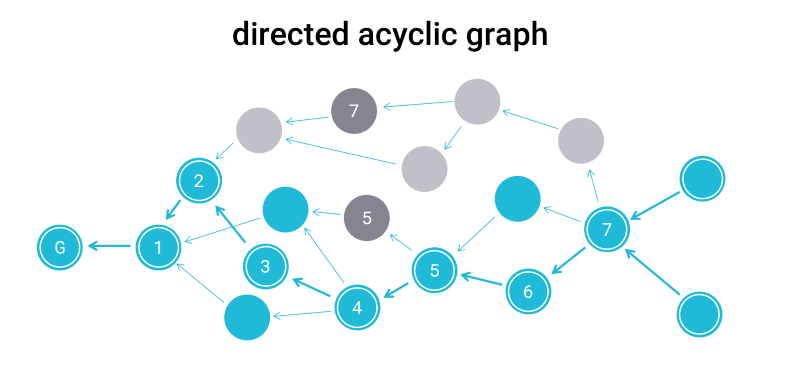

EVEN Network (EVEN Cross-chain Interaction Network) — открытая децентрализованная система, позволяющая пользователям взаимодействовать сразу с несколькими блокчейн платформами: производить кросс-чейн переводы, обменивать и хранить крипто-активы, создавать и выполнять cмарт-контракты в нескольких платформах, а также реализовывать и выполнять полноценные децентрализованные приложения с любой бизнес-логикой, используя инфраструктуру сети.

Основной устойчивого функционирования распределенной сети является логически  стройный протокол, позволяющий обеспечить решение трех основных задач: защиты конфиденциальности, распределенности и сохранности данных. Исторически, доверие к продуктам или услугам зарабатывается в течение всей их истории. Физические или электронные записи сопровождают каждый объект и подтверждают его происхождение, назначение, количество и историю. Создание, сопровождение и подтверждение всей этой информации добавляет весомый «налог на доверие», выражающийся в трудозатратах банков, бухгалтерии, юристов, аудиторов, службы контроля качества и других служб. При этом, зачастую, важная информация теряется, бывает недоступна, а иногда и сознательно скрывается.

Четвертая промышленная революция продолжает размывать границу между физическим и цифровым мирами, и блокчейн существенно облегчает аутентичность и целостность данных, необходимых для сопровождения объектов и услуг вдоль всей цепи стоимости. Более того, блокчейн вводит взаимно совместимый слой транзакций, в котором незнакомые между собой стороны могут в реальном времени обмениваться финансовыми и физическими ценностями. 

Блокчейн встраивает кошелек в машины, в результате чего машины могут вести собственный баланс прибылей и убытков, а также дает возможность машинам совершать транзакции с другими машинами в автоматическом режиме. Новые модели бизнеса, ориентированные на взаимодействие между машинами и формы обмена ценностями между ними, появляются чуть ли не каждый день. Однако в том, что касается масштабирования, требований к вычислительным ресурсам и стоимости транзакций, современные технологии блокчейна имеют серьезные ограничения.

В этой связи новым адекватным способом решения известных проблем является технологии распределенного хранения реестра (DLT), которая с каждым днем все глубже проникают в реальный сектор экономики. Причем, они находят себе применение даже в таких традиционно консервативных видах бизнеса, как добыча нефти и газа. Практика показывает, что DLT может успешно применяться везде, где есть большие массивы информации, объединенные в базы данных и нужна их неизменность.

Одной из базовых моделей, успешно реализованных в проектах DLT (IOITA, Byteball) на сегодняшний день является DAG - это тип технологии распределенных реестров, отличающийся от Блокчейнов структурой записей и асинхронностью. 

В классической технологии блокчейн транзакции в начале группируются в блок, после чего, по прошествии какого-то времени такой блок добавляется в цепочку из таких блоков. В такой системе пропускная способность и время транзакции ограничены размером блока и временем, которое необходимо для генерации нового блока.

 
В модели DAG - направленный ацикличный граф (от английского Directed Acyclic Graph) каждая транзакция сразу же добавляется в такой граф, состоящий из множества транзакций, записывающихся не последовательно, а одновременно. Здесь нет блоков, поэтому нет и проблем с его размером.

В такой структуре пользователи сами обслуживают сеть. Прежде, чем отправить какую-либо транзакцию, необходимо подтвердить не менее одной, а чаще две предыдущих. Именно поэтому здесь нет майнеров и мастернод.

Преимущества такого решения:
- Быстрота выполнения транзакций
- Нет комиссий (или они мизерны)
- Более масштабируем по сравнению с блокчейн.

Однако видимые преимущества данной модели в чистом виде компенсируются следующими недостатками:

- Проблемы с масштабируемостью (необходимо синхронизировать блокчейн каждый раз при добавлении новой транзакции).
- При малом количестве участников сети, транзакции могут подтверждаться длительное время, а при их отсутствии вообще никогда не быть подтвержденными.

Имеющиеся недостатки, как показала практика эксплуатации подобного рода сетей, наносят тяжелый урон завоеваниям блокчейн технологий, и речь здесь идет о децентрализации. Например в IOTА, для управления всеми ветвлениями Tangle используется нода Coordiantor, которая по сути является сервером валидации. 

Есть ли пути решить эту проблему и каким-то изящным способом устранить имеющиеся недостатки и превратить их в достоинство?

Анализ существующих подходов в реализации DLT и алгоритма DAG - в частности, позволил предположить, что такое решение есть. При изучении изображений графов транзакций, например сети IOTA,  нетрудно заметить, что временная ось эволюции графа направлена справа налево. Да, так и должно быть:  граф направленный и ациклический, новая транзакция является контентно ориентированным сообщением и в силу этого факта, не ведая своего места в топологии сети, вынуждена уповать на “милость” координатора. И если её не дождаться (а так бывает), транзакция может и не подтвердиться. 

Наше решение, которое позволило изменить направление времени эволюции в DAG и добиться максимальной децентрализации,  это переопределение сущности транзакции из контентно в топологически ориентированную и использование алгоритма подсчета рейтинга. При этом все преимущества модели сохраняются в полном объеме.