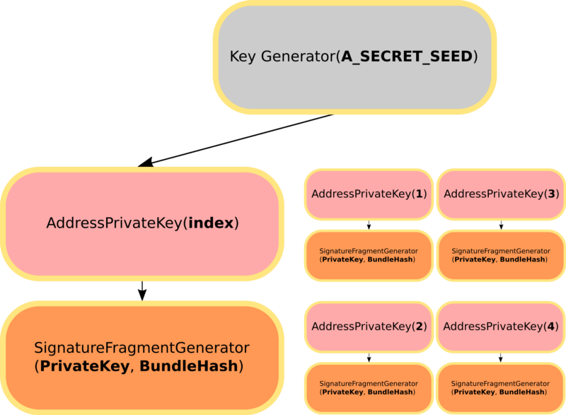

## Отправка и валидация транзакций

Перевод цифровых активов в базовом протоколе сети EVEN производится *методом полной траты* со счетов, обеспечивающих необходимый объем для передачи. В отличии от метода частичных трат - это когда средства переводятся со счетов с положительным балансом частично, - данный метод имеет ряд преимуществ. 
**Первое**: упрощенный и однозначный подсчет баланса без необходимости анализировать практически все транзакции корреспондентов для подсчета объема - суммы с необходимого количества счетов переводятся полностью, остаток в виде сдачи возвращается исходящей транзакцией на счет отправителя.
**Второе**: весь положительный исходящий объем аккумулируется только на новых счетах - уменьшается риск дискредитации приватного ключа подписи.
**Третье**, имеющее прямое отношение к 3D (DLT блокчейнам): упрощенный подсчет момента или место в блок-чейне при проведении снапшота за счет упрощенного анализа баланса - баланс содержится только на исходящих счетах.
Чтобы понять как в базовом протоколе реализуется передача информационных активов - обратимся к классическому примеру. 
 Алиса имеет начальное число A_SECRET_SEED, которое содержит 100 единиц в 4 разных адресах, в сумма балансов которых и дает это значение:

	seed : A_SECRET_SEED 
	address[0] : QGHFGFQSGQFS …… AAA, balance : 10 
	address[1] : QGHFGFQSGQFS …… BBB, balance : 5 
	address[2] : QGHFGFQSGQFS …… CCC, balance : 25 
	address[3] : QGHFGFQSGQFS …… DDD, balance : 60 
	address[4] : QGHFGFQSGQFS …… EEE, balance : 0

Боб ничего не имеет на своих кошельках:

	seed : B_SECRET_SEED 
	address[0] : AHGSHFSJHFSJ…… QQQ, balance : 0 
	address[1] : AHGSHFSJHFSJ…… VVV, balance : 0

Алиса принимает решение отправить Бобу 80 единиц информации на адрес AHGSHFSJHFSJ…… QQQ . 
Сообщением в базовом протоколе EVEN является связанный хеш индексами набор транзакций трех типов: ввод, вывод и мета-транзакции. 
Для нашего сценария сначала необходимо  подготовить выходную транзакцию, что означает, что мы хотим отправить на адрес Боба  80 единиц информации:

*Вывести транзакцию на адрес Боба 80 информационных единиц*

Далее нужно будет подготовить входную транзакцию. В данном сценарии потребуется использовать все четыре адреса, которые содержат ( 10 + 5 + 25 + 60 > 80) информационных единиц для выполнения выходного значения в сумме 80.

*Четыре входные транзакции, которые расходуют единицы по адресу Боба*

Далее нужно будет подготовить входную транзакцию. В данном сценарии потребуется использовать все четыре адреса, которые содержат ( 10 + 5 + 25 + 60 > 80) информационных единиц для выполнения выходного значения в сумме 80. 
Входная транзакция должна содержать подпись транзакции, это означает, что необходимо добавить  дополнительную мета-транзакцию для переноса подписи, необходимо добавить её:

*Добавление в сообщение мета-транзакций для передачи подписи*

Формирование сообщения не закончено - получен не сбалансированный пакет. Так как сформировано четыре транзакции на 100 информационных  единиц: 10 + 5 + 25 + 60 = 100 входов и 80 выходов, существует остаток в размере 20 информационных единиц,  которые нужно вернуть на счет кошелька отправителя. Для этого необходимо сформировать дополнительную транзакцию. Кошелек создает новый адрес для получения выходной транзакции остатка с пометкой *_unspend_*:

 

После этого сбалансированный пакет получен и можно приступать к окончательному формированию сообщения. Для этого необходимо заполнить последовательно индексы транзакций, последний индекс и сгенерировать **хеш-функцию** пакета с помощью **хеш-функции SHA-3**. 

*Заполнение индексов*

После этого сбалансированный пакет получен и можно приступать к окончательному формированию сообщения. Для этого необходимо заполнить последовательно индексы транзакций, последний индекс и сгенерировать **хеш-функцию** пакета с помощью **хеш-функции SHA-3**. Используемая хеш-функция использует алгоритм губки, который последовательно будет поглощать транзакции, проверяя каждый элемент по одному (порядок важен), а затем генерировать  результат. Кроме того, на этапе получения хеша пакета функция проверит, является ли хеш пакета безопасным или нет. Если нет, она изменит устаревший тег uголовной транзакции (транзакция с индексом 0) и снова сгенерирует хеш.
Псоле того, как хеш сообщения получен, необходимо продолжить заполнение транзакций и получить следующий набор:

*Заполнение хешей сообщения*

Далее необходимо подписать входные транзакции с помощью закрытого ключа соответствующего адреса. Для этого можно получить адресный закрытый ключ от генератора ключей с помощью A_SECRET_SEED HD кошелька. Используя адресный секретный ключ, становиться возможным  использование Генератора фрагментов подписи с закрытым ключом и пакетным хешем для получения подписи транзакции.

 

*Использование генератора ключей для получения генератора фрагмента подписи.*
  
 

 

*Заполнение подписи соответствующим генератором фрагментов подписи 
для каждой входной транзакции.*

После этого все части сообщения готовы.

Далее происходит подключение цепи собственных транзакции указанием в поле trunk значения  хеша последней входной транзакции и подключение цепи транзакций, полученных в раздел inbox неподтвержденных транзакций указанием хеше	й головных транзакций сообщений. Ниже представлен эскиз  схемы подключения.
 
 

*Схема подключения ветвей DAG.*

 

После этого сообщение готово к отправке.